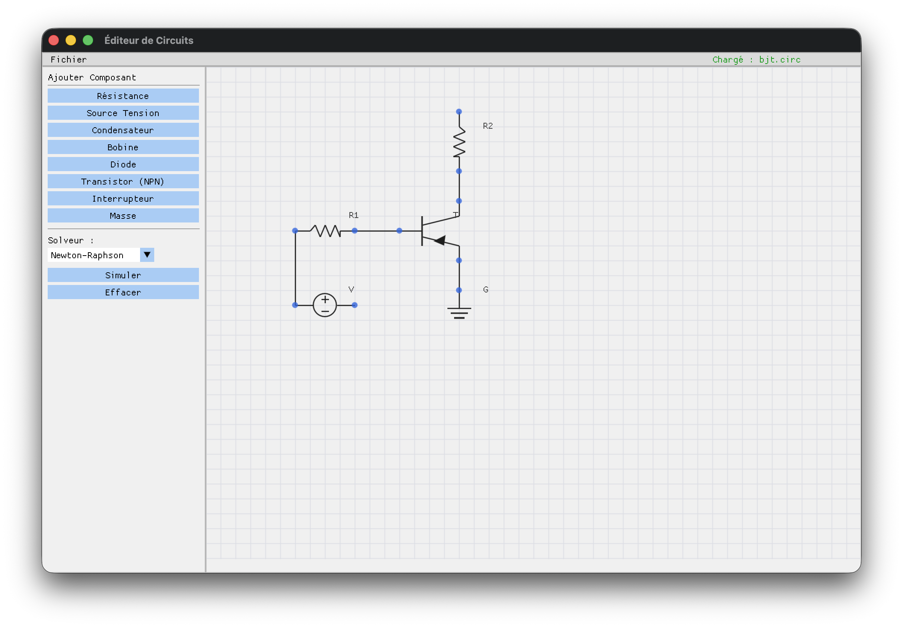

# Analogic Circuit Simulator

<div align="center">
  
</div>

# 

An analogic circuit solver, written in C++ as part of my engineering class.
Made alongside my classmates Anas Tariq and Achille Train-Lagarde.

# Compiling

```
mkdir build
cd build
cmake ..
make
```
