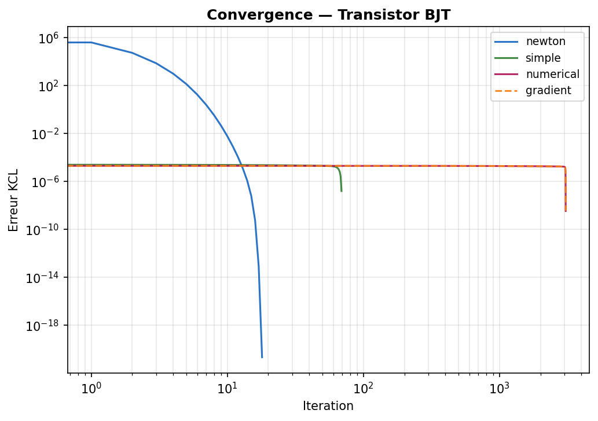
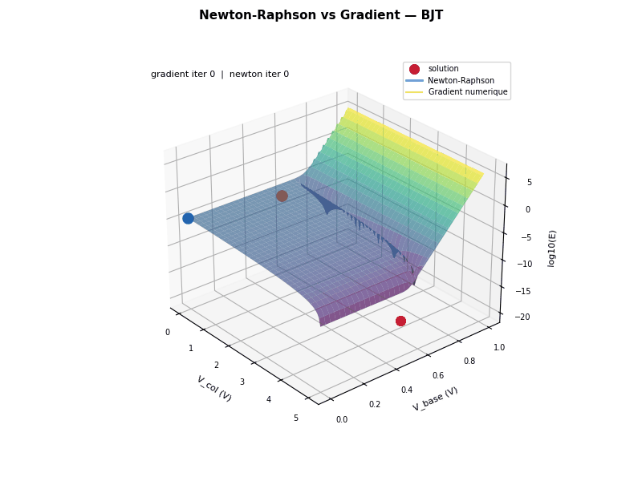
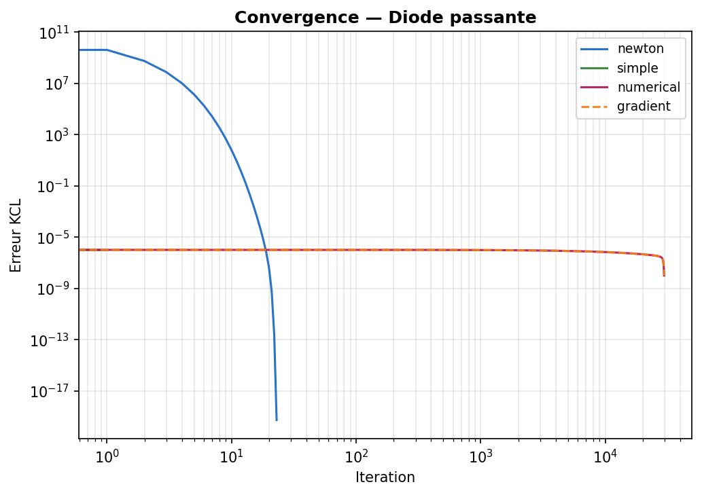
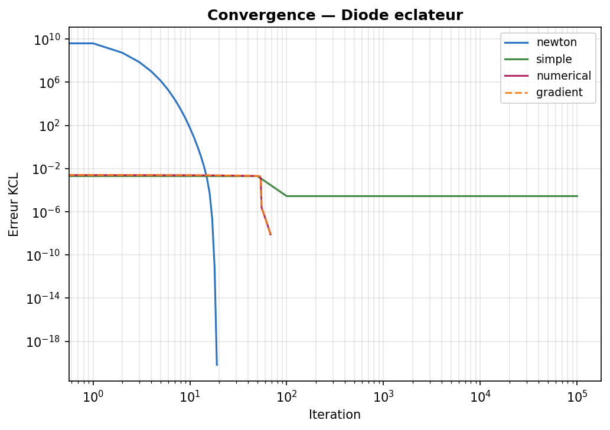
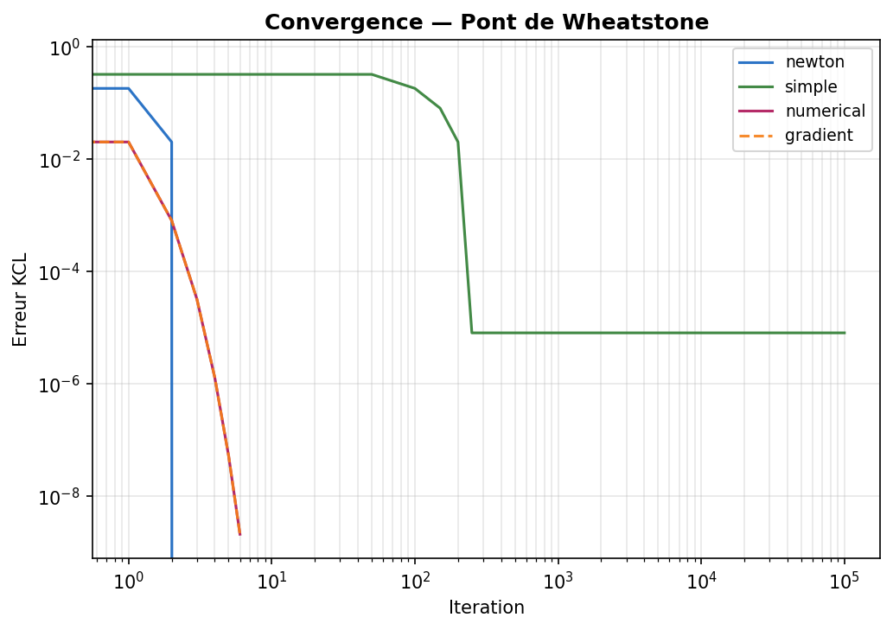
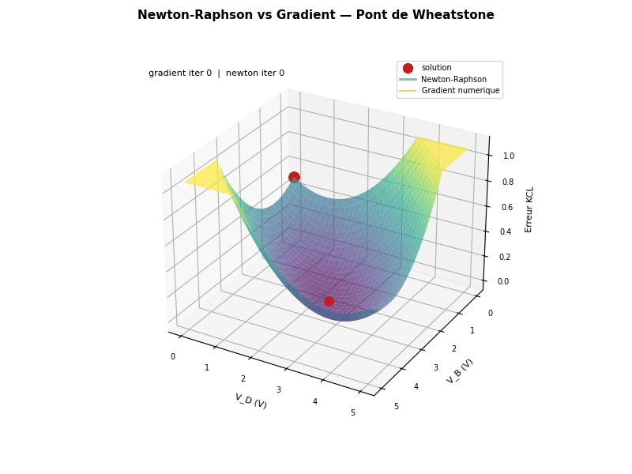
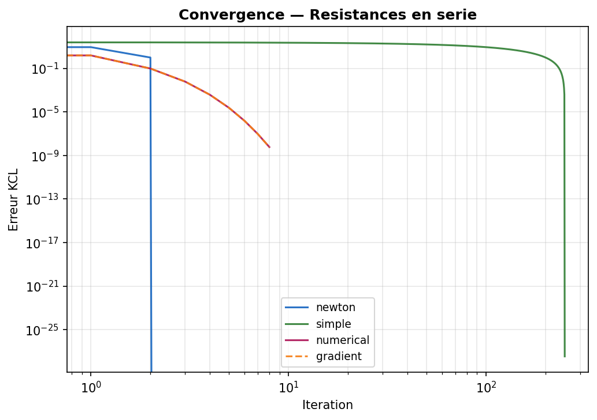
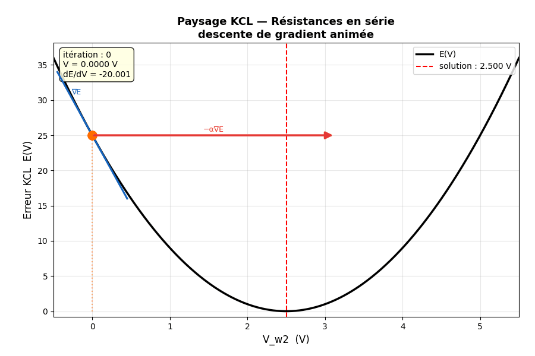

# Analogic Circuit Simulator


An interactive analog circuit schematic editor and SPICE-style nonlinear DC operating point simulator built in C++. 

The integrated editor allows users to place discrete analog components, route interconnections, configure circuit parameters, and solve for node voltages and branch currents using numerical iterative methods.

<div align="center">
  
</div>

---

## Features

* **Interactive Schematic Canvas**: Grid-based canvas powered by Dear ImGui with drag-and-drop placement, component rotation, pin-to-pin wire drawing, selection, and deletion.
* **Linear & Nonlinear Device Modeling**: Support for resistors, DC voltage/current sources, ground references, semiconductor diodes (Shockley model), and Bipolar Junction Transistors (BJT Ebers-Moll model).
* **Solvers**: Nonlinear circuit simulation using Modified Nodal Analysis (MNA) with Newton-Raphson iterations and gradient descent convergence tracking.
* **Serialization & Netlisting**: Save and load circuit topologies from persistent disk formats (`.circ` / `.cir`).
* **Convergence & Sweep Visualization**: Built-in verification plots demonstrating operating point convergence trajectories and gradient descent behavior across forward/reverse diode circuits and BJT networks.


### Simulation & Solver Pipeline

1. **Topology Extraction**: Pin intersections and wire networks are parsed into distinct electrical nodes referenced to a ground plane ($0\text{ V}$).
2. **MNA Matrix Formulation**: Linear elements populate conductance matrices directly, while independent sources formulate constraint equations.
3. **Nonlinear Iteration**: Diodes and BJTs are linearized around an operating point using tangent companion models, iteratively updated via Newton-Raphson until the residual voltage and current deltas satisfy tolerance thresholds.


### Solver Convergence Analysis

The project includes convergence plots and state-space visualizations demonstrating solver stability across various nonlinear topologies :

#### BJT Amplifier Network

| Iterative Convergence Trajectory  | Multi-variable Operating Point Dynamics  |
| :---: | :---: |
|   |   |

#### Diode Circuits

| Forward-Biased Diode Convergence  | Diode Clamping Circuit Convergence  |
| :---: | :---: |
|   |   |

#### Wheatstone Bridge & Chained Topologies

| Wheatstone Bridge Convergence  | Wheatstone Sweep Dynamics  |
| :---: | :---: |
|   |   |

| Chained Network Convergence  | 1D Series Gradient Behavior  |
| :---: | :---: |
|   |   |


## Example Circuits

The `circuits/` directory contains verified test schematics:

* `bjt.circ`: NPN transistor amplifier stage.
* `diode_clamp.circ` / `diode_forward.circ` / `diode_reversed.circ`: Diode characteristics under different biasing regimes.
* `wheatstone.circ`: Resistive Wheatstone bridge balance analysis.
* `r_serie.circ` / `r_para.circ`: Baseline series and parallel resistor divider networks.
* `and.circ`: Diode/transistor logic AND gate circuit.


## Build and Run

```bash
# Clone the repository
git clone https://github.com/lmichaudel/analogic-circuit-simulator.git
cd analogic-circuit-simulator

# Configure the build directory
cmake -B build -DCMAKE_BUILD_TYPE=Release

# Compile the target
cmake --build build --config Release

# Launch the simulator
./build/editor/circuit_simulator
```

## Controls & Keybindings

* **Left Click**: Select component / place active component / start wire route.
* **Right Click**: Cancel active wire route / context options.
* **R**: Rotate selected component by 90 degrees.
